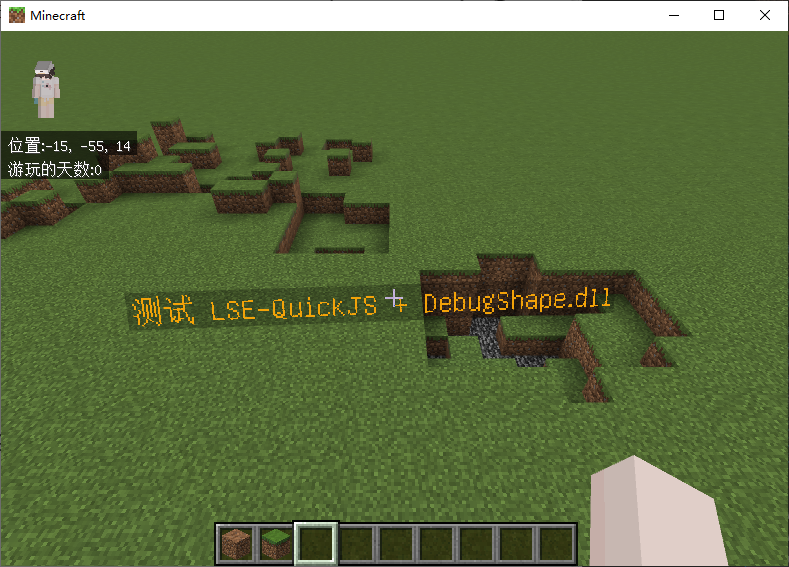

# DebugShape - 基岩版调试图形封装库 (Bedrock Edition Debug Shape Wrapper)

基岩版调试图形封装库，用于在基岩版游戏中绘制调试图形。  
A Bedrock Edition debug shape wrapper for drawing debug shapes in-game.




## Features / 功能

- 支持箭头、立方体、圆形、线段、球体、文本等基本图形
- Support for arrows, boxes, circles, lines, spheres, text and other basic shapes
- 支持 LegacyScriptEngine(QuickJS) 脚本引擎调用
- Supports LegacyScriptEngine (QuickJS) script engine

## Usage / 使用方法

### LegacyScriptEngine(QuickJS) API

> 此功能仅支持 LegacyScriptEngine-QuickJS 后端，版本需要严格匹配。  
> This feature only supports the LegacyScriptEngine-QuickJS backend. Versions must match strictly.
>
> DebugShape 使用了绑定框架，使 DebugShape 可以与 QuickJS 引擎直接通信而不经过 LegacyRemoteCall 中间商转发，从而实现更好的性能和更好的使用体验。  
> DebugShape uses a binding framework to communicate directly with the QuickJS engine without going through the LegacyRemoteCall proxy, achieving better performance and user experience.

> **注意：** 当你的脚本导入 DebugShape.dll 后，用户需要每个版本使用与 Minecraft 版本匹配的 DebugShape.dll，否则可能会导致功能异常。  
> **Note:** After your script imports DebugShape.dll, users must use a DebugShape.dll that matches the Minecraft version for each release, otherwise it may cause malfunctions.

1. 在 manifest.json 中声明对 DebugShape.dll 的依赖，避免 QuickJS 加载时找不到 DebugShape.dll。  
   Declare the dependency on DebugShape.dll in manifest.json to prevent QuickJS from failing to find it at load time.

```json
{
  "entry": "<entry file>",
  "name": "<plugin name>",
  "type": "lse-quickjs",
  "dependencies": [
    {
      "name": "legacy-script-engine-quickjs"
    },
    {
      "name": "DebugShape"
    }
  ]
}
```

2. 在 QuickJS 中直接 `import` DebugShape 模块即可使用。  
   Directly `import` the DebugShape module in QuickJS to use it.

```js
import { ShapeType } from "DebugShape.dll";

// do something
```

> 完整示例请参考本项目的 [`test-addon/main.js`](./test-addon/main.js) 文件。  
> For a complete example, see the [`test-addon/main.js`](./test-addon/main.js) file in this project.
>
> 此实例包含创建一个全局的 DebugText 实例并动态更新文本内容和随机颜色的示例。  
> This example demonstrates creating a global DebugText instance and dynamically updating text content with random colors.

> 你可以在这里找到关于 DebugShape.dll 提供的接口完整类型定义文件:  
> You can find the complete type definition file of the interfaces provided by DebugShape.dll here:
>
> [src-addon/DebugShape.d.ts](./src-addon/DebugShape.d.ts)

### C++ API

- xmake.lua

```lua
add_repositories("iceblcokmc https://github.com/IceBlcokMC/xmake-repo.git")

add_requires("debug_shape 0.1.0")

target("YourProject")
    add_packages("debug_shape")
```

```cpp
#include "debug_shape/api/shape/IDebugText.h"

void MyMod::enable() {
    auto shape = debug_shape::IDebugText::create(Vec3{0,92,0}, "foo");
    shape->draw();
}
```

## Quick experience / 快速体验

1. Clone the source code / 克隆源码

```bash
git clone https://github.com/engsr6982/DebugShape.git
```

2. Compile the project and start the test code. / 编译项目并启动测试代码

```bash
cd DebugShape
xmake f --test=y
```

3. Install levilamina and mod / 安装 LeviLamina 和模组

4. Use the **/shape** command for a quick experience. / 使用 **/shape** 命令快速体验

> Since this is test code, only basic demonstrations are provided. For more attributes (color, scaling, etc.), please
> use the API.  
> 由于这是测试代码，仅提供基础演示。如需更多属性（颜色、缩放等），请使用 API。

```log
? shape
21:41:44.798 INFO [Server] shape:
21:41:44.798 INFO [Server] Minecraft DebugShape
21:41:44.798 INFO [Server] Usage:
21:41:44.798 INFO [Server] - /shape arrow <start: x y z> <end: x y z>
21:41:44.798 INFO [Server] - /shape box <start: x y z> <end: x y z>
21:41:44.798 INFO [Server] - /shape circle <position: x y z> [scale: float]
21:41:44.798 INFO [Server] - /shape clear
21:41:44.798 INFO [Server] - /shape extension bounds_box <start: x y z> <end: x y z>
21:41:44.798 INFO [Server] - /shape line <start: x y z> <end: x y z>
21:41:44.798 INFO [Server] - /shape sphere <position: x y z> [scale: float]
21:41:44.798 INFO [Server] - /shape text <position: x y z> <text: string>
```

## LICENSE

LGPL v3 or later
